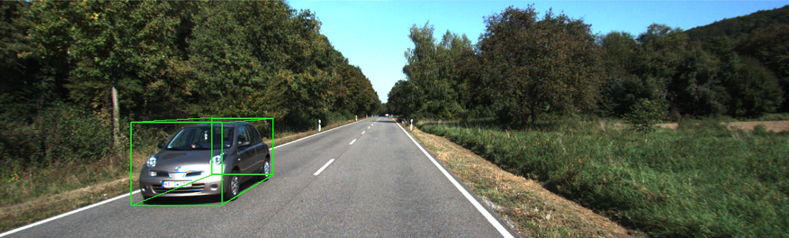

#  window 版 SMOKE


##  添加功能

- 省去 linux 下编译 DConv 的 cuda 代码，可以直接在 window 下训练和测试
- 提供了重新训练的模型：[百度云盘](https://pan.baidu.com/s/1GQdUfi6W9VbsCpwshMxlxA)，提取码： hdbb
- 改变训练循环，并使用梯度累加机制
- 增添了 finetune 和 resume 等功能
- 提供了测试单张图像的例子


## 训练

1. 下载 KITTI 数据，并修改成一下结构，把图像列表放在 ImageSets 文件夹中，然后在 datasets 中创建 kitti 目录的软连接
```
kitti
│──training
│    ├──calib 
│    ├──label_2 
│    ├──image_2
│    └──ImageSets
└──testing
     ├──calib 
     ├──image_2
     └──ImageSets
```
     
2. 修改相关参数，比如 configs/smoke_gn_vector.yaml 和 smoke/config/defaults.py 

3. 执行 tools/plain_train_net.py 即可

## 测试

1. 把 smoke/engine/defaults.py 中的 --eval-only 设成 True

3. 执行 tools/plain_train_net.py 即可

不过现在 KITTI 只有论文才能在线测试了，代码只能生成测试集的结果而已

## 测试单张图像

1. 指定 tools/detector.py 中 --ckpt 为训练好的模型，直接执行 detector.py 即可



本人电脑比较弱鸡，batch 很小，就只训练了 50 epoch ....

## acknowledge

https://github.com/lzccccc/SMOKE


